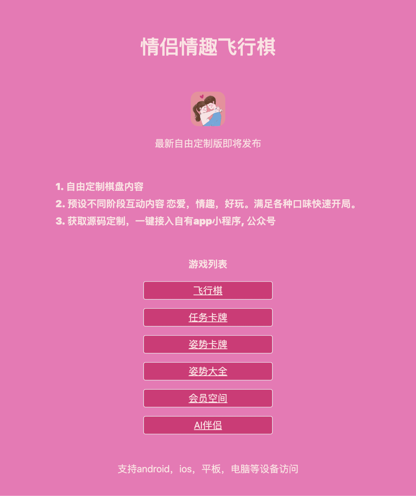

## 情侣飞行棋 && 姿势卡牌



### 这是一个情侣专用的小游戏网站，不依赖数据库， 自己改一下客服收款信息和Logo就能用来赚钱了。

### 部署运行
30s部署， fork后在deno deploy里面直接选择项目

进入到powershell然后cd进入项目的文件夹，下载deno：

```
iwr https://deno.land/x/install/install.ps1 -useb | iex
```
开发命令
```
deno task start
```
### 技术架构
虽然是纯前端项目， 但是使用了fresh + deno的技术栈。 相对小众但是和next.js有相似的地方，半小时左右可上手。

### 其他分享

vip获取的方法，在devtool的console输入：

```
localStorage.setItem('lockVip',JSON.stringify({"type":"boolean","data":true}))
localStorage.setItem('vip', true)
```

[参考自](https://17fei.fun)